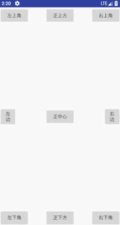
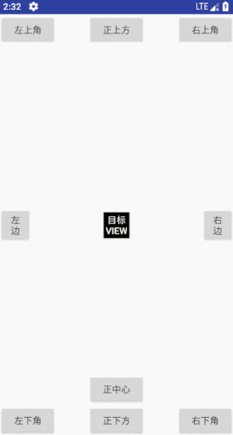
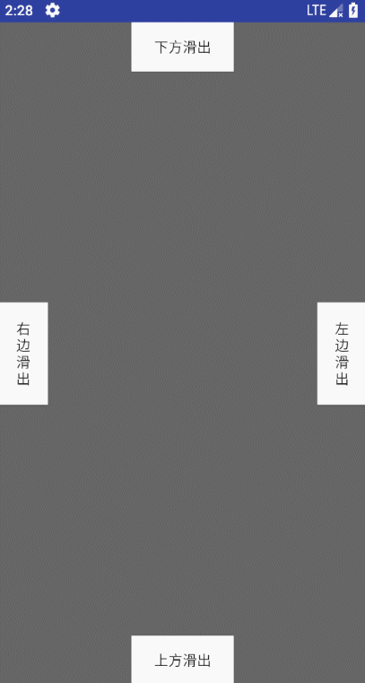
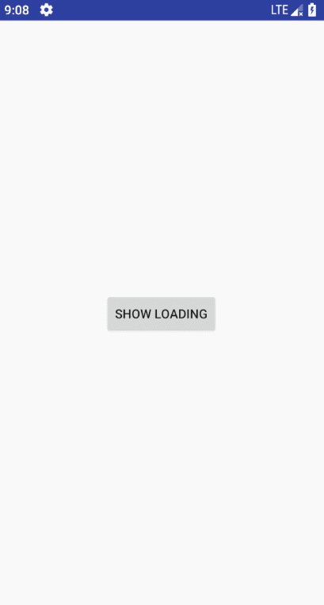
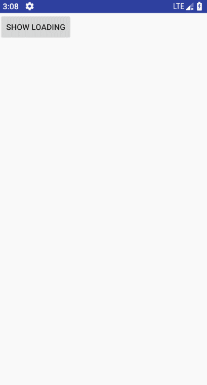
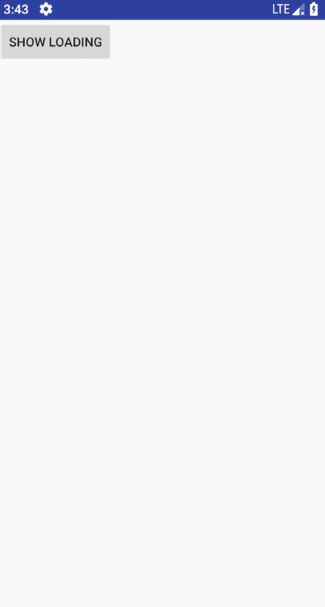

# GenjiDialog


[](https://jitpack.io/#q876625596/GenjiDialogV2)

#### 基于kotlin的通用dialog


之前我是自己Fork了的一个叫[NiceDialog](https://github.com/SheHuan/NiceDialog)的库，
但是在这基础上自己加了很多功能来自用，但是后来开始用kotlin开发之后，
发现很多东西都能简化，毕竟kotlin的语法糖不能浪费了，所以就有了这个库，
只要我还在做Android开发，应该会一直维护该库。

#### 依赖

``` groovy
allprojects {
    repositories {
        ...
        maven { url 'https://jitpack.io' }
    }
}
```

``` groovy
dependencies {
    implementation 'com.github.q876625596:GenjiDialogV2:1.1.2'
}
```
废话不多说，直接上图







#### 内置大量基础动画，基本能满足基本需求

#### 第一次写README也不知道该怎么吹，就直接贴代码吧

``` kotlin
newGenjiDialog {
    width = dp2px(100f)
    height = dp2px(100f)
}.showOnWindow(supportFragmentManager)
```

就这么简单，一个默认居中的加载中loadDialog就出来了，如图：


### 1、位置

#### 如果我想让他显示在屏幕右上角怎么办？非常简单！

``` kotlin
newGenjiDialog {
    width = dp2px(100f)
    height = dp2px(100f)
    gravity = DialogGravity.RIGHT_TOP
}.showOnWindow(supportFragmentManager)
```
#### DialogGravity这个枚举中我设定了9种显示方式，左上，中上，右上，左中，正中，右中，左下，中下，右下
因此只需要添加一行代码指定dialog的位置就行了、效果如图：



你现在可能要问了，你只设置了9个位置，我需要偏移怎么办呢,
当然，这时候就需要用到偏移了

``` kotlin
newGenjiDialog {
    width = dp2px(100f)
    height = dp2px(100f)
    verticalMargin = dp2px(100f).toFloat()
    horizontalMargin = dp2px(100f).toFloat()
    gravity = DialogGravity.RIGHT_TOP
}.showOnWindow(supportFragmentManager)
```

就这样我就给dialog加上了横向纵向分别100dp的偏移，效果如图：



关于这个偏移量，这里我多说两句，原本偏移量的取值范围是在[0-1]，指的是所占屏幕宽高的百分比，
但是为了方便起见，我这里给大于1的偏移量自动换算成了百分比，如果针对个别机型有误差的，可以自行换算成[0-1]即可

### 2、动画

细心地你可能发现了，在屏幕右上角显示的时候是从屏幕边缘滑出的，
没错，我给DialogGravity的每一个显示位置都设定了默认的动画，
当没有指定动画的时候就会按照默认的动画来显示、

#### 当然自定义动画是肯定要有的
``` kotlin
newGenjiDialog {
    width = dp2px(100f)
    height = dp2px(100f)
    animStyle = R.style.ScaleADEnterExitAnimationX50Y50
    gravity = DialogGravity.RIGHT_TOP
}.showOnWindow(supportFragmentManager)
```

这样就完成了动画的自定义，当然你还可以这样写:
``` kotlin
dialog.showOnWindow(supportFragmentManager,DialogGravity.RIGHT_TOP,R.style.ScaleADEnterExitAnimationX50Y50)
```

效果如图：



内置动画我在style文件中注释写了作用，可以自己去看看

#### 如果想要贴在一个view附近怎么办？

``` kotlin
newGenjiDialog {
    width = dp2px(100f)
    height = dp2px(100f)
    animStyle = R.style.ScaleADEnterExitAnimationX50Y100
    gravityAsView = DialogGravity.CENTER_TOP
}.showOnView(supportFragmentManager,showLoading)
```

需要注意的是这里的gravaty换成了gravityAsView，效果如图：


同样你还可以这样写:
``` kotlin
dialog.showOnWindow(supportFragmentManager,DialogGravity.RIGHT_TOP,R.style.ScaleADEnterExitAnimationX50Y50)
```

##### 相对view的偏移量 offsetX和offsetY属性
这两个属性建议去DialogOptions中的dialogAsView()方法去查看方法注释


##### 附加一个稍微特殊点的滑出方式（带遮罩）
``` kotlin
newGenjiDialog { genjiDialog ->
    //设置布局
    layoutId = R.layout.slide_view_bottom
    //isLazy = true
    //设置横纵向占满
    isFullHorizontal = true
    isFullVerticalOverStatusBar = true
    //阴影透明度
    dimAmount = 0f
    //处理事件/数据绑定
    convertListenerFun { holder, dialog ->
        //设置点击realView以外的部分就dismiss
        holder.setOnClickListener(R.id.bottomTouchView) {
            if (canClick) {
                dialog.dismiss()
            }
        }.setOnClickListener(R.id.topTouchView) {
            if (canClick) {
                dialog.dismiss()
            }
        }
    }
    setOnEnterAnimator { rootView ->
        //在此处设置进入动画
        AnimatorSet().apply {
            duration = 500L
            val realView = rootView.findViewById<View>(R.id.realView)
            val touchView = rootView.findViewById<View>(R.id.bottomTouchView)
            val topTouchView = rootView.findViewById<View>(R.id.topTouchView)
            val maskLayout = rootView.findViewById<View>(R.id.maskLayout)
            //给realView的父布局(遮罩布局)设置距顶部margin
            maskLayout?.apply {
                layoutParams = (layoutParams as ConstraintLayout.LayoutParams).apply {
                    topMargin = (slideForBottom.y + slideForBottom.height).toInt()
                }
            }
            play(ObjectAnimator
                    .ofFloat(realView, "y", -UtilsExtension.dp2px(resources, 200f).toFloat(), 0f))
                    .with(ObjectAnimator
                            .ofFloat(touchView, "alpha", 0f, 1f))
                    .with(ObjectAnimator
                            .ofFloat(topTouchView, "alpha", 0f, 1f))
        }
    }
    setOnExitAnimator {
        //退出动画
        AnimatorSet().apply {
            duration = 500L
            val realView = it.findViewById<View>(R.id.realView)
            val touchView = it.findViewById<View>(R.id.bottomTouchView)
            val topTouchView = it.findViewById<View>(R.id.topTouchView)
            play(ObjectAnimator
                    .ofFloat(realView, "y", 0f, -UtilsExtension.dp2px(resources, 200f).toFloat()))
                    .with(ObjectAnimator
                            .ofFloat(touchView, "alpha", 1f, 0f))
                    .with(ObjectAnimator
                            .ofFloat(topTouchView, "alpha", 1f, 0f))
        }
    }
}.showOnWindow(supportFragmentManager)
```

效果图：


#### 基本的显示模式都已经说了，接下来就放一个整体可见的参数表格出来


##### GenjiDialog中
| 属性名/方法名 | 介绍 |
| ------ | ------ |
| rootView | layoutId所对应的布局 |
| getMyActivity() | 获取该dialog所在的activity |
| setDialogOptions(...) | 设置dialogOptions |
| getDialogOptions() | 获取dialogOptions |
| extendsOptions() | 当继承GenjiDialog时需要重写该方法，在该方法里面设置新的dialogOptions |
| showOnWindow(...) | 将dialog显示在屏幕中，有多个重载方法，具体可见源码注释 |
| showOnView(...) | 将dialog依附于某个View，有多个重载方法，具体可见源码注释 |

##### DialogOptions
| 属性名/方法名 | 介绍 |
| ------ | ------ |
| layoutId | 布局id，默认:R.layout.loading_layout |
| dialogStyle | dialog的样式，一般情况下不用修改，为了方便某些朋友可能有特殊需求，所以放出来可供重写，默认：DialogFragment.STYLE_NO_TITLE |
| dialogThemeFun | dialog的主题，同上，重写方法setDialogTheme(fun) |
| setStatusBarModeFun | dialog的状态栏设置，同上，重写方法setStatusMode(fun) |
| animStyle | dialog的进出动画，用于一般情况，内置了很多日常所需动画，可以到res/values/styles中查看，动画文件在res/anim中查看，默认根据gravity来判断 |
| setOnEnterAnimator(fun) | dialog的进入动画，这个动画是用于一些特殊情况，比如上面的带遮罩的滑出动画，默认：null |
| exitAnimator(fun) | dialog的退出动画，同上 （这两个动画的示例请看上面带遮罩滑出动画的代码，也可以去源码查看）|
| canClick | 否可以触发取消，默认：true，比如在动画开始时将此属性设置false，防止在动画进行时，被再次触发动画，当使用上面两种自定义特殊动画时，我已经默认添加了改变这个状态值的监听 |
| isLazy | 是否懒加载，默认：false，是否在动画完成时才执行convertListener |
| duration | 懒加载的延时，默认：0L，配合isLazy使用，这个值一般设置为动画的时长，为了保证动画流畅 |
| dialogStatusBarColor | dialog的statusBar颜色，默认：透明，一般来说无需改变 |
| width | dialog宽度，默认：0px |
| height | dialog高度，默认：0px |
| isFullHorizontal | dialog是否横向占满，默认：false |
| isFullVertical | dialog是否纵向占满，默认：false，该纵向占满并非全屏，纵向占满会自动扣掉状态栏的高度 |
| isFullVerticalOverStatusBar | dialog是否纵向占满，默认：false，该纵向占满全屏不会扣掉状态栏高度,是真正的全屏 |
| verticalMargin | dialog上下边距，默认：0，详细注释请在源码中查看 |
| horizontalMargin | dialog左右边距，默认：0，详细注释请在源码中查看 |
| fullVerticalMargin | dialog在上下占满时的边距，默认：0px |
| fullHorizontalMargin | dialog在左右占满时的边距，默认：0px |
| dimAmount | dialog背景的阴影的透明度：默认：0.3f |
| gravity | dialog显示为showOnWindow()时的位置：默认：DialogGravity.CENTER_CENTER |
| gravityAsView | dialog显示为showOnView()时的位置：默认：DialogGravity.CENTER_BOTTOM |
| dialogViewX | x轴坐标值，用于特殊动画时定位dialog，默认：0px |
| dialogViewY | y轴坐标值，用于特殊动画时定位dialog，默认：0px |
| offsetX | 当dialog依附在view上时x轴的偏移量，默认：0px |
| offsetX | 当dialog依附在view上时x轴的偏移量，默认：0px |
| touchCancel | 是否点击屏幕区域取消（不包含返回按钮），默认：false |
| outCancel | 是否点击外部取消，默认：false，当 touchCancel == true时此属性无效，必须是 touchCancel和该属性均为false时，那么点击屏幕区域和返回按钮都不能关闭dialog |
| showDismissMap | 显示与消失的监听map |
| onKeyListener | 按钮监听 |
| convertListener | view初始化 |


这里我给出的属性/方法，注释不详细可以到DialogOptions源码里面查看，那里面注释很详细

#### 因为也是第一次写kotlin的库，可能有一些东西不算很完美，希望有能力强的大佬能够指出

# 喜欢的话请点个star支持一下，谢谢


MIT License

Copyright (c) 2018 q876625596

Permission is hereby granted, free of charge, to any person obtaining a copy
of this software and associated documentation files (the "Software"), to deal
in the Software without restriction, including without limitation the rights
to use, copy, modify, merge, publish, distribute, sublicense, and/or sell
copies of the Software, and to permit persons to whom the Software is
furnished to do so, subject to the following conditions:

The above copyright notice and this permission notice shall be included in all
copies or substantial portions of the Software.

THE SOFTWARE IS PROVIDED "AS IS", WITHOUT WARRANTY OF ANY KIND, EXPRESS OR
IMPLIED, INCLUDING BUT NOT LIMITED TO THE WARRANTIES OF MERCHANTABILITY,
FITNESS FOR A PARTICULAR PURPOSE AND NONINFRINGEMENT. IN NO EVENT SHALL THE
AUTHORS OR COPYRIGHT HOLDERS BE LIABLE FOR ANY CLAIM, DAMAGES OR OTHER
LIABILITY, WHETHER IN AN ACTION OF CONTRACT, TORT OR OTHERWISE, ARISING FROM,
OUT OF OR IN CONNECTION WITH THE SOFTWARE OR THE USE OR OTHER DEALINGS IN THE
SOFTWARE.