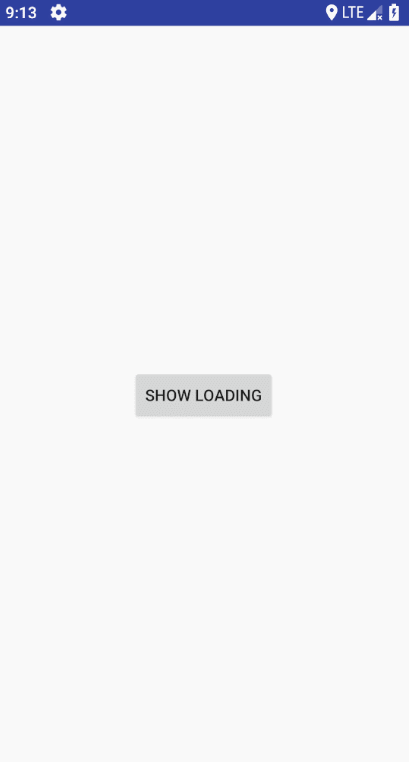

# GenjiDialog

[](https://jitpack.io/#q876625596/GenjiDialogV2)

#### 基于kotlin的通用dialog


之前我是自己Fork了的一个叫[NiceDialog](https://github.com/SheHuan/NiceDialog)的库，
但是在这基础上自己加了很多功能来自用，但是后来开始用kotlin开发之后，
发现很多东西都能简化，毕竟kotlin的语法糖不能浪费了，所以就有了这个库，
只要我还在做Android开发，应该会一直维护该库。

#### 依赖

``` groovy
allprojects {
	repositories {
		...
		maven { url 'https://jitpack.io' }
	}
}
```

``` groovy
dependencies {
    implementation 'com.github.q876625596:GenjiDialogV2:1.0.1'
}
```
废话不多说，直接上图


#### 内置大量基础动画，基本能满足基本需求

#### 第一次写README也不知道该怎么吹，就直接贴代码吧

``` kotlin
newGenjiDialog {
    width = dp2px(100f)
    height = dp2px(100f)
}.showOnWindow(supportFragmentManager)
```

就这么简单，一个默认居中的加载中loadDialog就出来了，如图：


### 1、位置

#### 如果我想让他显示在屏幕右上角怎么办？非常简单！

``` kotlin
newGenjiDialog {
    width = dp2px(100f)
    height = dp2px(100f)
    gravity = DialogGravity.RIGHT_TOP
}.showOnWindow(supportFragmentManager)
```
#### DialogGravity这个枚举中我设定了9种显示方式，左上，中上，右上，左中，正中，右中，左下，中下，右下
因此只需要添加一行代码指定dialog的位置就行了、效果如图：


你现在可能要问了，你只设置了9个位置，我需要偏移怎么办呢,
当然，这时候就需要用到偏移了

``` kotlin
newGenjiDialog {
    width = dp2px(100f)
    height = dp2px(100f)
    verticalMargin = dp2px(100f).toFloat()
    horizontalMargin = dp2px(100f).toFloat()
    gravity = DialogGravity.RIGHT_TOP
}.showOnWindow(supportFragmentManager)
```

就这样我就给dialog加上了横向纵向分别100dp的偏移，效果如图：


关于这个偏移量，这里我多说两句，原本偏移量的取值范围是在[0-1]，指的是所占屏幕宽高的百分比，
但是为了方便起见，我这里给大于1的偏移量自动换算成了百分比，如果针对个别机型有误差的，可以自行换算成[0-1]即可

### 2、动画

细心地你可能发现了，在屏幕右上角显示的时候是从屏幕边缘滑出的，
没错，我给DialogGravity的每一个显示位置都设定了默认的动画，
当没有指定动画的时候就会按照默认的动画来显示、

#### 当然自定义动画是肯定要有的
``` kotlin
newGenjiDialog {
    width = dp2px(100f)
    height = dp2px(100f)
    animStyle = R.style.ScaleADEnterExitAnimationX50Y50
    gravity = DialogGravity.RIGHT_TOP
}.showOnWindow(supportFragmentManager)
```

这样就完成了动画的自定义，当然你还可以这样写:
``` kotlin
dialog.showOnWindow(supportFragmentManager,DialogGravity.RIGHT_TOP,R.style.ScaleADEnterExitAnimationX50Y50)
```

效果如图：


内置动画我在style文件中注释写了作用，可以自己去看看

#### 如果想要贴在一个view附近怎么办？

``` kotlin
newGenjiDialog {
    width = dp2px(100f)
    height = dp2px(100f)
    animStyle = R.style.ScaleADEnterExitAnimationX50Y100
    gravityAsView = DialogGravity.CENTER_TOP
}.showOnView(supportFragmentManager,showLoading)
```

需要注意的是这里的gravaty换成了gravityAsView，效果如图：


同样你还可以这样写:
``` kotlin
dialog.showOnWindow(supportFragmentManager,DialogGravity.RIGHT_TOP,R.style.ScaleADEnterExitAnimationX50Y50)
```

##### 相对view的偏移量 offsetX和offsetY属性
这两个属性建议去DialogOptions中的dialogAsView()方法去查看方法注释


##### 附加一个稍微特殊点的滑出方式（带遮罩）
``` kotlin
newGenjiDialog {
    width = dp2px(100f)
    height = dp2px(100f)
    slideGravity = Gravity.TOP
    dimAmount = 0f
    animStyle = R.style.MaskAlphaADAnimation
    gravityAsView = DialogGravity.CENTER_BOTTOM
}.showOnView(supportFragmentManager,showLoading)
```

效果图：




#### 基本的显示模式都已经说了，接下来就放一个整体代码出来

``` kotlin
newGenjiDialog {
    //设置布局
    layoutId = R.layout.aaa
    //设置宽度
    width = dp2px(100f)
    //设置高度
    height = dp2px(100f)
    //当时showOnWindow时设置显示位置
    //gravity = DialogGravity.RIGHT_TOP
    //处理事件/数据绑定
    convertListenerFun { view, holder, dialog ->
        view.image.setOnClickListener {
            dialog.dismiss()
        }
    }
    //添加show/dismiss时的监听事件
    addShowDismissListener("eventKey") {
        onDialogShow {
            Toast.makeText(this@MainActivity, "show", Toast.LENGTH_SHORT).show()
        }
        onDialogDismiss {
            Toast.makeText(this@MainActivity, "dismiss", Toast.LENGTH_SHORT).show()
        }
    }
    //监听按键
    onKeyListenerFun { dialog, keyCode, event ->
        return@onKeyListenerFun false
    }
    //有遮罩的滑出位置
    //slideGravity = Gravity.TOP
    //阴影透明度
    dimAmount = 0.3f
    //动画
    animStyle = R.style.ScaleOverShootEnterExitAnimationX0Y0
    //相对view的偏移
    offsetX = -showLoading.width / 2
    offsetY = -showLoading.height / 2
    //相对View的位置
    gravityAsView = DialogGravity.RIGHT_BOTTOM
    //showOnWindow的偏移
    //verticalMargin = dp2px(100f).toFloat()
    //horizontalMargin = dp2px(100f).toFloat()
    //isFullHorizontal 是否横向占满
    //isFullVertical 是否纵向占满 该纵向占满并非全屏，纵向占满会自动扣掉状态栏的高度
    //isFullVerticalOverStatusBar 该纵向占满全屏不会扣掉状态栏高度
    //touchCancel 是否点击屏幕区域取消（不包含返回按钮）
    //outCancel 是否点击外部取消 需要和touchCancel = false 一起使用
}.showOnView(supportFragmentManager, showLoading)
```


这里我给出了大部分属性/方法，以下部分不常用的可以到DialogOptions里面查看，注释很详细

#### 因为也是第一次写kotlin的库，可能有一些东西不算很完美，希望有能力强的大佬能够指出

# 喜欢的话请点个star支持一下，谢谢


MIT License

Copyright (c) 2018 q876625596

Permission is hereby granted, free of charge, to any person obtaining a copy
of this software and associated documentation files (the "Software"), to deal
in the Software without restriction, including without limitation the rights
to use, copy, modify, merge, publish, distribute, sublicense, and/or sell
copies of the Software, and to permit persons to whom the Software is
furnished to do so, subject to the following conditions:

The above copyright notice and this permission notice shall be included in all
copies or substantial portions of the Software.

THE SOFTWARE IS PROVIDED "AS IS", WITHOUT WARRANTY OF ANY KIND, EXPRESS OR
IMPLIED, INCLUDING BUT NOT LIMITED TO THE WARRANTIES OF MERCHANTABILITY,
FITNESS FOR A PARTICULAR PURPOSE AND NONINFRINGEMENT. IN NO EVENT SHALL THE
AUTHORS OR COPYRIGHT HOLDERS BE LIABLE FOR ANY CLAIM, DAMAGES OR OTHER
LIABILITY, WHETHER IN AN ACTION OF CONTRACT, TORT OR OTHERWISE, ARISING FROM,
OUT OF OR IN CONNECTION WITH THE SOFTWARE OR THE USE OR OTHER DEALINGS IN THE
SOFTWARE.